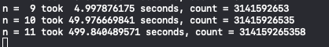

# pi-generator-from-blocks

This is a way to generate digits of pi by using elastic collisions
between an object 100^N larger than the other with a wall and counting
the number of collisions. 

Inspired by [this](https://www.youtube.com/watch?v=HEfHFsfGXjs) video
by 3Blue1Brown, [technical
paper](https://www.maths.tcd.ie/~lebed/Galperin).

## Usage

This program is written in Rust, primarily for speed. First, clone the
repository using `git clone
https://github.com/jakevossen5/pi-generator-from-blocks.git` 
or by downloading and extracting the zip. 

Then, install Rust from the [offical rust
guide](https://www.rust-lang.org/tools/install).

Compile the program using `RUSTFLAGS="-C target-cpu=native" cargo build --release`. Then you can run
the program using the executable found in the `target/release/` folder. By default, it will start with 1 digit, then
2, then 3, etc, until you cancel the program. You can modify the
starting value by change `n` in the source and recompiling.

## Notes

I found that 9 is about the limit a modern computer can calculate in a
reasonable time (about 10 seconds on my 2018 Macbook Pro, and similar
speeds on other computers). It gets _very_ hard to calculate numbers
above 10. 

Also, the weight of the small block is the smallest possible floating
point number. This is to try to prevent oveflow, which will happen if
you start with a small block of mass 1. Eventually there is going to
be an overflow somewhere because the numbers are so big, but it would
take hours to generate that number anyway. 

Each increase in n will take almost exactly 10 times longer to complete than
the previous n, making this approxemently a O(10^N) algorithm. For
example: 
.
